<!-- # Integrating Machine Learning with Discrete Choice

## Constraints

- 35 guaranteed minutes for the talk (60 - 15 - 10).
  - 15 minutes for questions at the end of the talk
  - [potentially] 10 minute delay at the beginning of the talk as people get settled.

## Idea Outline
- Gain the audience's attention:
  - Maybe start with a picture / image that shows what we want:
  logistic regression (math/stats/computation) -> conditional logit (accepted computational tool to operationalize econometric theory) -> eco-system of models developed in response (extensions of the tool based on economic theory).
  - Connect to my paper by saying that was an attempt at pushing this idea forward.
  I tried to make it happen by doing this with decision trees and non-compensatory decision making.
  - However, it hasn't taken off!
  No one is using decision trees in discrete choice papers to represent non-compensatory decision making in a general manner.
  - Perhaps there are factors holding the community back from embracing these this research direction for integrating ML with discrete choice?
  - Lesson? Invert the problem? Instead of asking how to increase integration of ML in discrete choice, ask what guarantee the exclusion of ML?
    - Answer: If it didn't work.
    - https://www.anup.io/2020/07/20/invert-always-invert/
    - https://fs.blog/2014/06/avoiding-stupidity/
  - Focus on machine learning fails.
  2 or 3 is probably all that's needed.
  Show examples from "Underspecification Presents Challenges for Credibility in Modern Machine Learning."
  Show the issues:
    - (Silent) Training Errors:
    ML models may not train correctly, even though the training process exits without error.
    [Training Diagnostics / Fake-Data simulation needed]
      - Linear probes paper from Yoshua Bengio as an example.
      - TRB neural network as an example.
    - (Silent) Modeling Errors:
    ML models may perform well one's training criterion, but nevertheless fail to accurately represent reality.
    [Posterior Predictive Check needed]
      - PPC examples from Machine Learning meets Micro-economics project.
    - (Silent) Counterfactual Errors
    ML models may do a great job of representing one's training set well, but nonetheless extrapolate from that training set in highly undesirable ways.
    [Prior Needed]
      - Examples from "Underspecification Presents Challenges for Credibility in Modern Machine Learning."
      - Examples from "Conditional Visualization for Statistical Models: An Introduction to the condvis Package in R" (see Figure 13)
      Being far from the training data is a bigger and bigger problem in high-dimensional spaces, even just for counterfactual prediction.
      - Examples from "Visualizing statistical models: Removing the blindfold"
- Clearly state the talk's motivating need / problem
- State how I have solved / ameliorated these issues
- Give the audience one thing to remember
- Show an outline
- Proceed through the 3 - 5 main points:
  - How to integrate ML with DCM: Map ML to DCM concepts
  - How to integrate ML with DCM: use much caution.
    - Software testing
    - Inference testing
    (Including prior predictive checks / fake data simulation)
    - Model testing
  - How to integrate ML with DCM:
  combine with causal inference to get the big picture right.

## Slide Outline

- [0] Title slide
- [1] What is it that we actually want to do?
- [2] What is it that we actually want to do? (Part 2)
- [3] What did I do in the past?
- [4] What's the problem?
- [5] What's the remedy?
- [6] What's the outline (of the talk)?
- [7 - 9] Training errors
  - [7] Issue definition
  - [8] Diagnostic tools
    - Visualization of gradient over time for each parameter
    - linear probes for neural networks
    - prior predictive checks (helps diagnose if your regularization is harmful)
  - [9] Fake data simulation for verification of successful training ability against whatever conditions you simulate for.
- [10 - 12] Overfitting errors
  - [10] Issue definition
  - [11] Cross-validation / resampling as general solution
  - [12] Considerations regarding structured datasets.
- [13 - 27] Underfitting errors
  - [13] Issue definition
  - [14] Issue elaboration
  Likelihood, prior, and posterior approximation family.
  - [15] Remedies
  Alter the likelihood, prior, or posterior approximation family.
  - [16 - 21] PPC -> likelihood editing
    - [16] main idea--simulate
    - [17] main idea--compare
    - [18] modify / example-likelihood-expansion-1:
    check-yourself repo example using knots for SUV price. See UCLA 2019 talk.
    Explain setting one slide.
    - [19] modify / example-likelihood-expansion-1:
    check-yourself repo example using knots for SUV price. See UCLA 2019 talk.
    Explain change the next slide.
    - [20] modify / example-likelihood-expansion-2:
    checking-zoo repo example for ASCs with stated preference analysis.
    Explain setting one slide.
    - [21] modify / example-likelihood-expansion-2:
    checking-zoo repo example for ASCs with stated preference analysis.
    Explain change the next slide.
  - [22 - 27] Counterfactual Prediction -> prior editing
    - [22] main idea--what do you already know the model should the model do?
    I.e. target elicitation / location-parameter-elicitation.
    Human-based (e.g. counterfactual regularization)
    Algorithm-based (e.g. knowledge distillation)
    - [23] counterfactual regularization
    (imagine monotonicity or elasticity magnitude regularization)
    Explain setting one slide.
    - [24] counterfactual regularization
    (imagine monotonicity or elasticity magnitude regularization)
    Explain technical form of regularization one slide.
    - [25] knowledge distillation
    (imagine mixed logit, regularized by a random forest's predictions...)
    Explain setting one slide.
    - [26] knowledge distillation
    (imagine mixed logit, regularized by a random forest's predictions...)
    Explain technical form of regularization one slide.
    Could be predictions as in traditional knowledge distillation.
    Could be the kernel as in random forest kernels.
    - [27] main idea--how should you penalize deviations from the target?
    Penalty design / distribution-elicitation
    e.g. gumbel vs normal
- [28 - 35] Causal errors
  - [28] Issue specification
  See discussion [here](https://github.com/timothyb0912/ci_for_prediction/blob/master/article/modeling_unmeasured_confounding.pdf).
  - [29 - 31] Issue diagnosis
  - [32 - 34] Solution methods
  Get better data, model the unobserved confounders, or bound the effects on one's inferences.
  - [35] Helpful links to resources
- [36] Contact slide

## Slides -->

class: center, middle

# Integrating Machine Learning   and Discrete Choice:   What Could Go Wrong?

Timothy Brathwaite, PhD  
March, 2021

---

## What is it that we actually want to do?

At a high level...

| From | To |
| --- | --- |
| Killer robot  </img> | Pet robot  </img>|

---

## What is it that we actually want to do?

We want to map mathematical and algorithmic models  
to a neat econometric story of human decision making.

| From | To |
| --- | --- |
| Neural Net Computational Graph   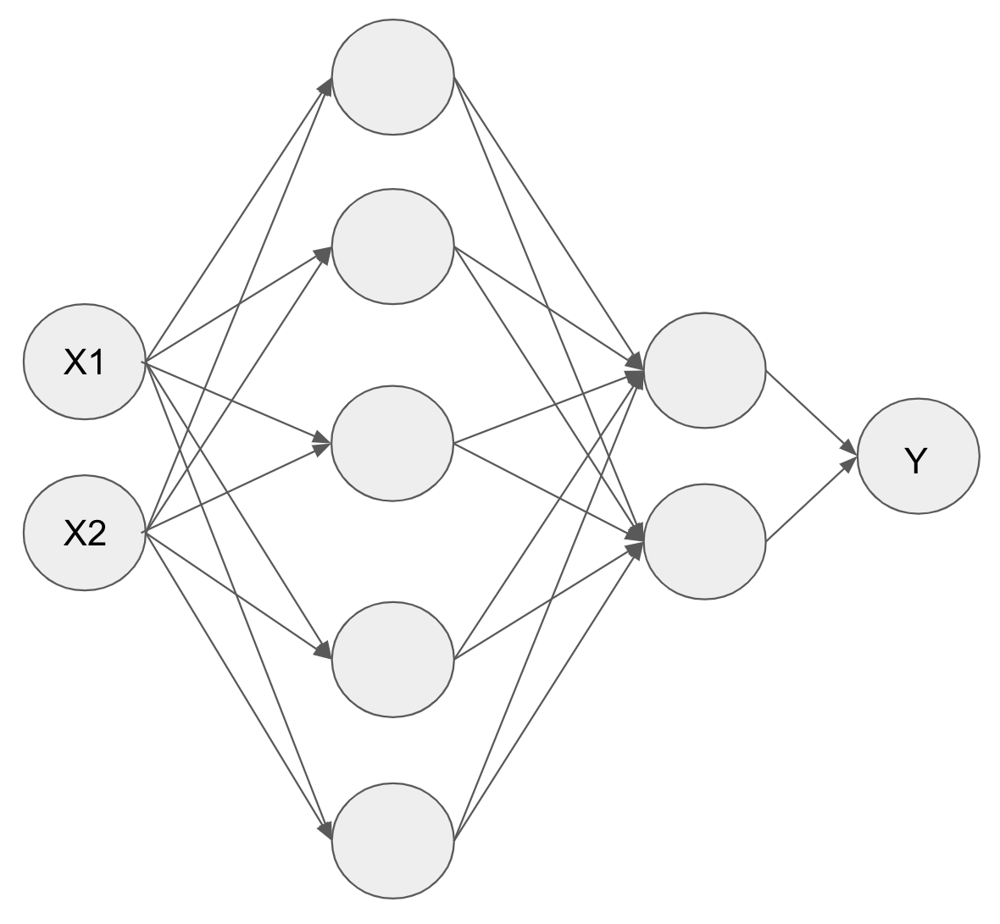</img> | Random Utility Causal Graph   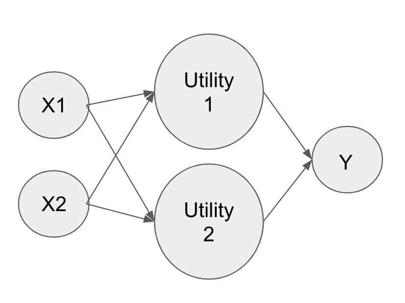</img> |

---

## What is it that we actually want to do? (Part 2)

In detail, we want to map machine learning models to
causal systems that operate at the disaggregate level,
with credible explanations for outcomes via causal mechanisms.

| From | To |
| --- | --- |
| Logistic Regression  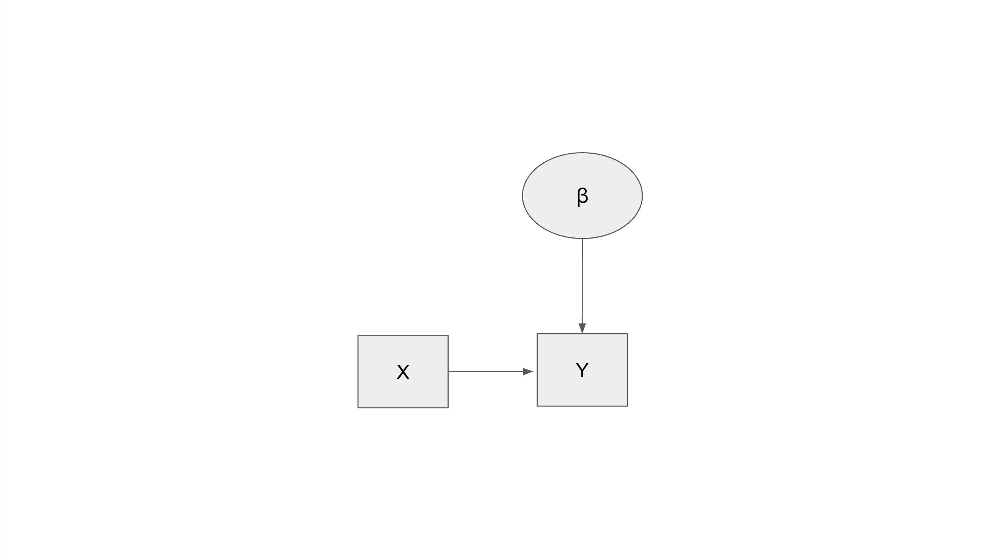</img> | Conditional Logit  </img>|

---

## What did I do in the past?

[Map](https://arxiv.org/pdf/1711.04826.pdf) decision trees to non-compensatory decision making (disjunctions-of-conjunctions).

| From | To |
| --- | --- |
|</img>| </img>|
| cute trees | partitioned spaces  |

----

## What's the problem?

Choice modellers are not using ML models (e.g. tree-based models) with their econometric interpretations.

Why not?

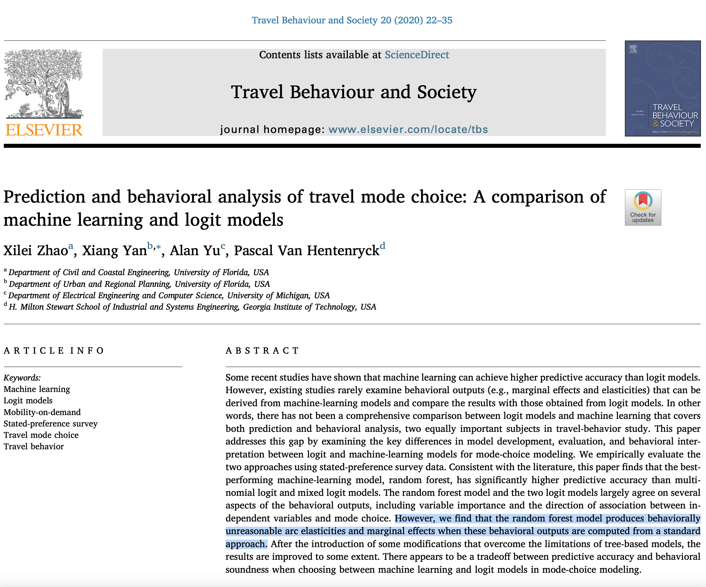</img>

---

## What's the remedy?

Focus on why we fail, and avoid the pitfalls.

</img>

---

## What's the roadmap?

What pitfalls will we discuss and commit to avoiding?

1. Training errors  
2. Overfitting  
3. Underfitting.
4. Neglecting causal inference

---

## Training errors: issue definition

When model training doesn't work out how you expected.

</img>

<!-- Include links, preferably non-paywalled for each of these -->
- bad initial values
- cyclic parameter updates
- miniscule-magnitude parameter updates
- exploding-magnitude parameter updates

---

## Training errors: diagnostic tools

- Visualization of gradient over time for each parameter
- Linear probes for neural networks
- Prior predictive checks
(i.e., is your regularization harmful?)

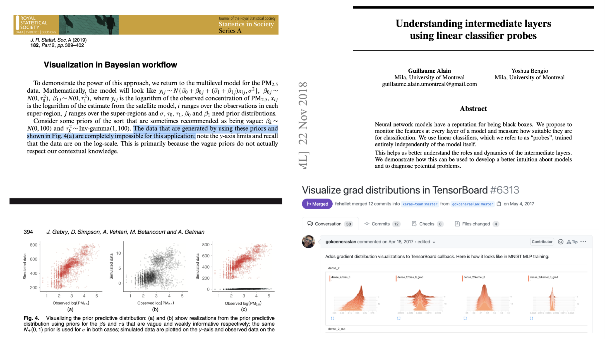</img>

---

## Training errors: remedial tools

Fake data simulation and training is a general tool for training error diagnosis.  
Can you make your fake data training fail the way real training fails?

<!-- | From | To |
| --- | --- |
</img>| </img>|  
| Real soldiers  | Toy soldiers  | -->

</img>

---

## Overfitting: issue definition

Our in-sample model performance is much better than our out-of-sample model performance.

</img>

---

## Overfitting: diagnostic tools

Cross-validation / resampling are a general solution for identifying overfitting.

</img>

---

## Overfitting: structural considerations

Hierarchical or otherwise non-exchangeable data (e.g. time series) require special care during resampling.

</img> </img>

---

## Underfitting: definition

> When some part(s) of one's model have not been adequately specialized to reflect the data generating process of one's data.

---

## Underfitting: elaboration

Likelihood, prior, and/or posterior approximation family may be underfit, in any combination.

<!-- Image-description: Inverted triangle (point down) where the vertices are the words "likelihood" (top left), "prior" (top right), "posterior approximation" (bottom). The words will hopefully be in a word cloud with font that looks handwritten. [Example](https://commoncog.com/blog/content/images/2018/12/Paper.Commonplace.30--1--1.png) -->

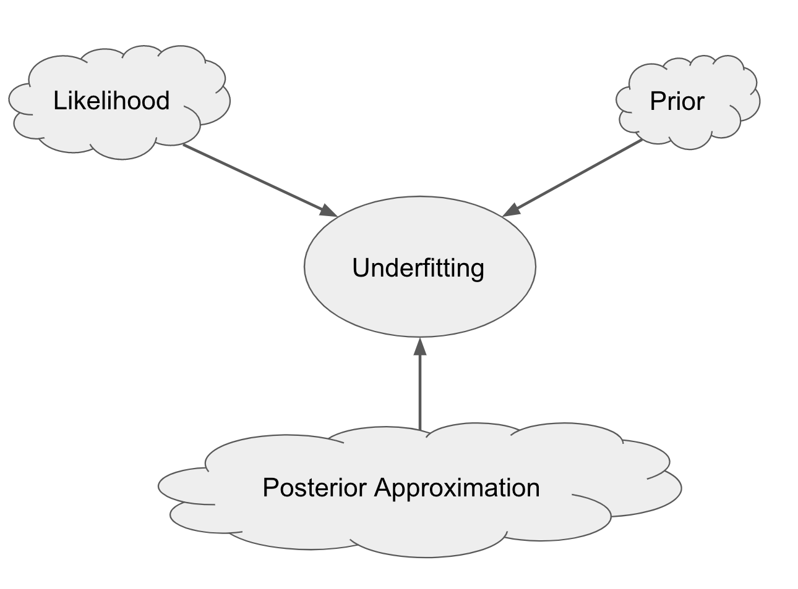</img>

---

## Underfitting: remediation

Alter the likelihood, prior, or posterior approximation family.

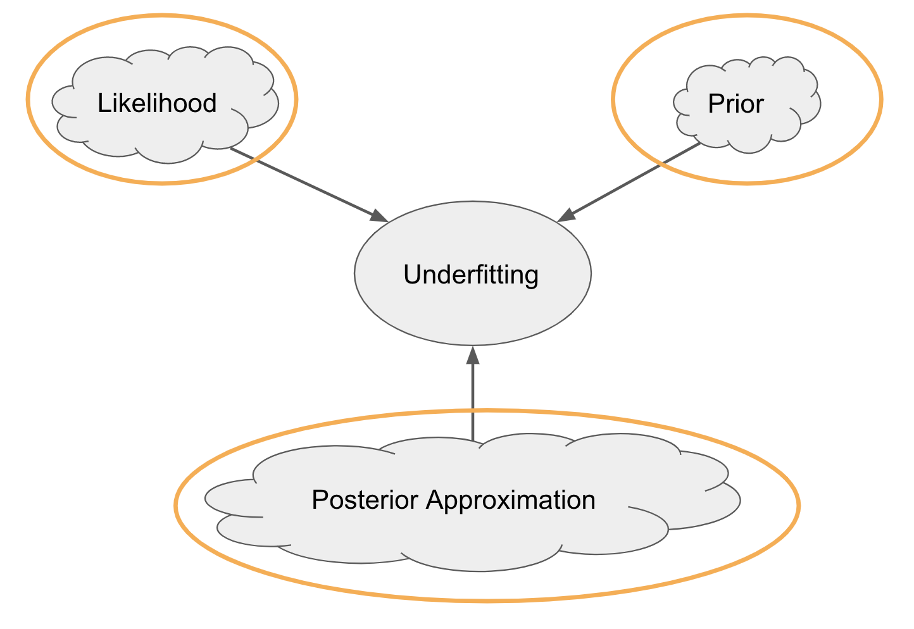</img>

---

## Underfitting: check the likelihood

Simulate
  - from one's maximum-likelihood solution
  - from posterior
<!--
Image-description: Simulation image from left side of [slide 10](https://docs.google.com/presentation/d/1NWLZ5rkqV0cUSQK75bFWxEsyoUEYEBvuDu1ImUkbl7k/edit#slide=id.g56f8ca2c38_0_252) -->

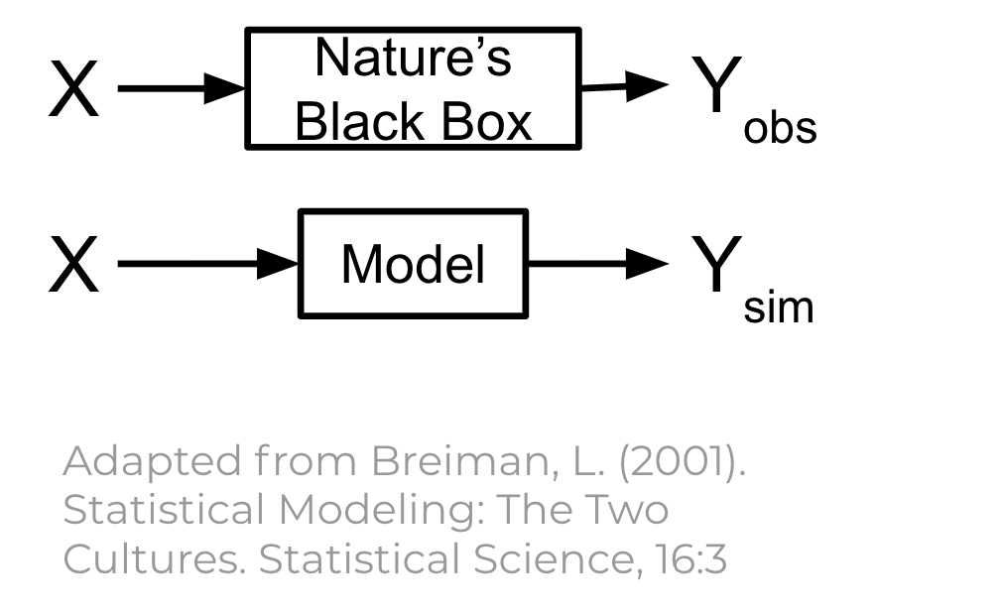</img>

---

## Underfitting: check the likelihood (cont'd)

<!-- main idea--compare -->

<!-- Image-description: Full image from [slide 10](https://docs.google.com/presentation/d/1NWLZ5rkqV0cUSQK75bFWxEsyoUEYEBvuDu1ImUkbl7k/edit#slide=id.g56f8ca2c38_0_252) -->

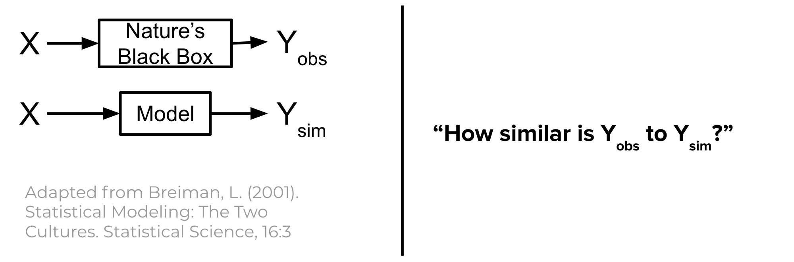</img>

---

## Underfitting: edit the likelihood (ex. 1A)

<!-- main idea--modify

example-likelihood-expansion-1:  
check-yourself repo example using knots for SUV price.  
See UCLA 2019 talk.  
Explain **setting** one slide.

Image-description:  
Display paper citation & talk through main relevant points:  
stated preferences for automobile purchases,  
emphasizing the choice of electric vehicles. -->

</img>

<!-- Be sure to include complex functional forms -->

---

## Underfitting: edit the likelihood (ex. 1B)

<!-- main idea--modify -->

<!-- example-likelihood-expansion-1:  
check-yourself repo example using knots for SUV price.  
See UCLA 2019 talk.  
Explain **change** one slide.

Image-description: Images from [slide 29](https://docs.google.com/presentation/d/1ycJ9hqwI35hW4Hp_uAtnoK8lEnDLUcDT5AtSR-i1Rws/edit#slide=id.g56f8ca2c38_0_548) -->

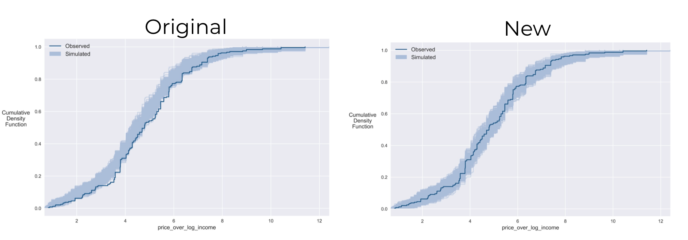</img>

The relative price variable was re-specified as piecewise linear with a knot at 3 and interacted with body type and with fuel type.

---

## Underfitting: edit the likelihood (ex. 2A)

<!-- main idea--modify

example-likelihood-expansion-2:  
checking-zoo repo example for ASCs with stated preference analysis.  
Explain **setting** one slide.

Image-description: Display paper citation & talk through main relevant points:  
DeVries 2015 (see checking zoo) stated preferences for blood pressure medication -->

</img>

---

## Underfitting: edit the likelihood (ex. 2B)

Sometimes, the needed likelihood edit is adding alternative specific constants.

| Missing ASCs   (Original) | All ASCs |
| ---| ---|
| 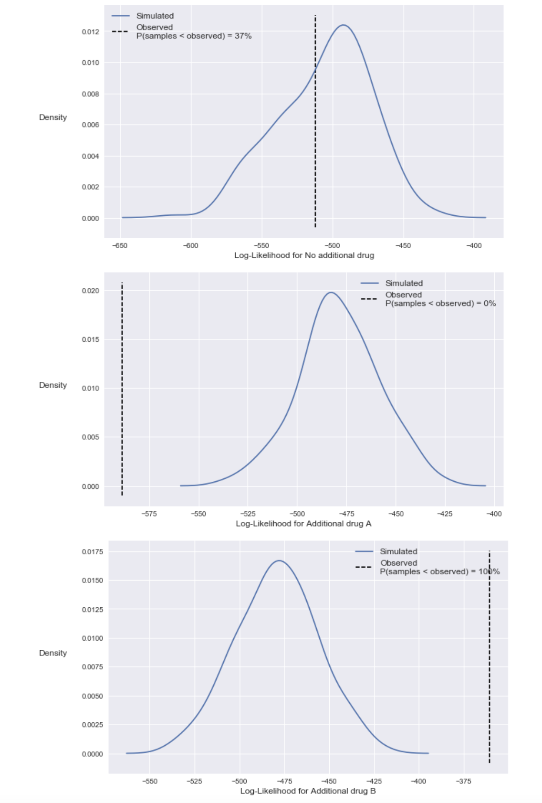</img> | 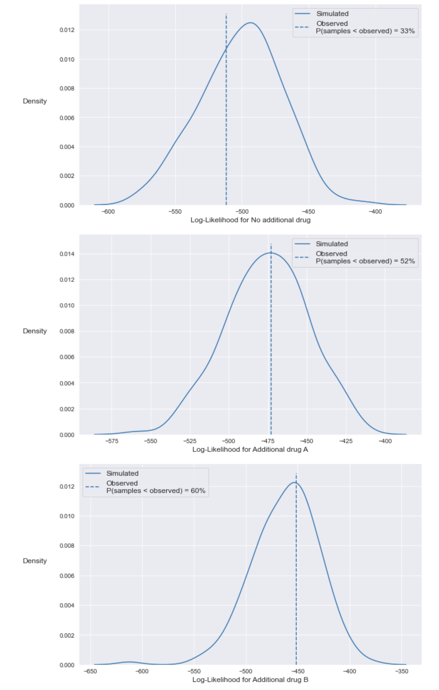</img> |
| Drug vs No-Drug  | Drug A vs Drug B vs No-Drug  |

---

## Underfitting: counterfactual prediction -> prior editing

main idea--what do you already know the model should the model do for given inputs?  
I.e. (prior) target elicitation / (prior) location-parameter-elicitation.
  - Human-based specification of model behavior = counterfactual regularization
  - Algorithm-based specification of model behavior = knowledge distillation

|Human teacher | Machine teacher|
| ---| ---|
| </img> | </img> |
| counterfactual regularization  | knowledge distillation  |

---

## Underfitting: counterfactual regularization as prior editing

Imagine regularizing for monotonicity or magnitude-of-elasticity.   
Ideally, we want ML predictive ability + behavioral realism.  
(I.e. We want our cake and we want to eat it too.)

</img>

---

## Underfitting: counterfactual regularization as prior editing

When regularizing for expected properties (e.g. monotonicity),
use a support that includes your counterfactual scenarios.

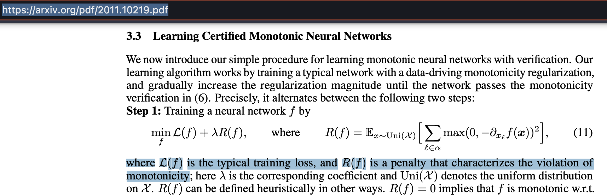</img>

<!-- LaTexIt
\DeclareMathOperator*{\argmin}{argmin}
\hat{\beta} &= \argmin_{\beta} \left \lbrace - \textrm{LogLikelihood} \left( Y; X, \beta \right) +
  \textrm{Reg} \left( \lambda, \beta, Y, X \right) \right \rbrace \\
\textrm{where } \textrm{Reg} \left( \cdot \right) &= \lambda \sum _{i=1} ^{N} \left[ P \left( Y \mid X, \beta \right) - P_{\textrm{Random\_Forest} \left( Y \mid X \right)} \right]^2 -->

See also [causal regularization](https://arxiv.org/pdf/1906.12179.pdf)
and [detecting non-causal artifacts](http://proceedings.mlr.press/v80/janzing18a/janzing18a.pdf)
for further variations on the theme of counterfactual regularization.

---

## Underfitting: knowledge distillation as prior editing

Imagine mixed logit, wandering through and regularized by a random forest's predictions.

<!-- Explain **setting** one slide.
Image-description: mixed logit wandering in a forest.
Maybe headless person with "mixed logit as words?"
Maybe "mixed logit on a shirt?"
See perhaps https://www.blackillustrations.com/illustrations/the-great-outdoors-illustration-pack -->
</img>

---

## Underfitting: knowledge distillation as prior editing

<!-- Imagine mixed logit, regularized by a random forest's predictions.
Explain **technical form** of regularization in one slide.
Could be predictions as in traditional knowledge distillation.
Could be the kernel as in random forest kernels. -->
As an example, consider the following

<!-- Image-description: Show image from [here](https://docs.google.com/presentation/d/1ycJ9hqwI35hW4Hp_uAtnoK8lEnDLUcDT5AtSR-i1Rws/edit#slide=id.g593527d002_0_0), replacing P_empirical with P_forest. Regenerate the equations with latexit. -->
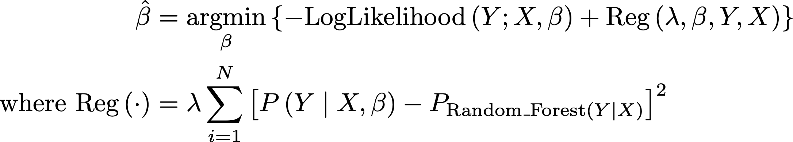</img>

---

## Underfitting: prior design considerations

How should you penalize deviations from the target?  
Recognize that penalty design = distribution-elicitation
<!-- Imagine penalizing according to a gumbel vs a normal distribution.

Image-description: two-panel image w/ left-side showing normal distribution + equation and right-side showing gumbel distribution + equation. -->

| Gumbel | Normal |
| --- | --- |
| </img> | </img> |
|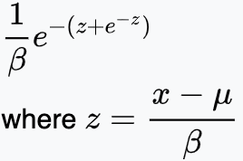</img>   |  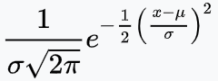</img>  |

---

## Causal errors: the final frontier

When modelling, ignoring one's data generating process **potentially** causes poor predictions.  
When unobserved confounding is present, one's usual likelihood [is wrong](https://github.com/timothyb0912/ci_for_prediction/blob/master/article/modeling_unmeasured_confounding.pdf).

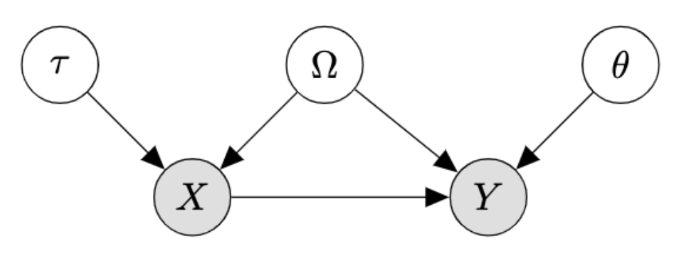</img>

---

## Causal errors: diagnosis

**Draw and test causal graphs for the system you are modelling.**

Imagine a mode choice model with the following, hypothesized causal graph.

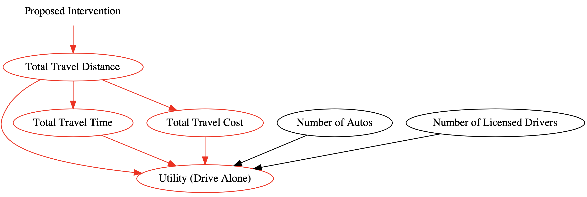</img>

This graph implies travel time is independent of travel cost, given travel distance.

---

## Causal errors: diagnosis

Failed independence tests in one's causal graph may come from unobserved confounders.

E.g. San Francisco Bay crossings likely confound travel cost and travel time, even after controlling for travel distance.

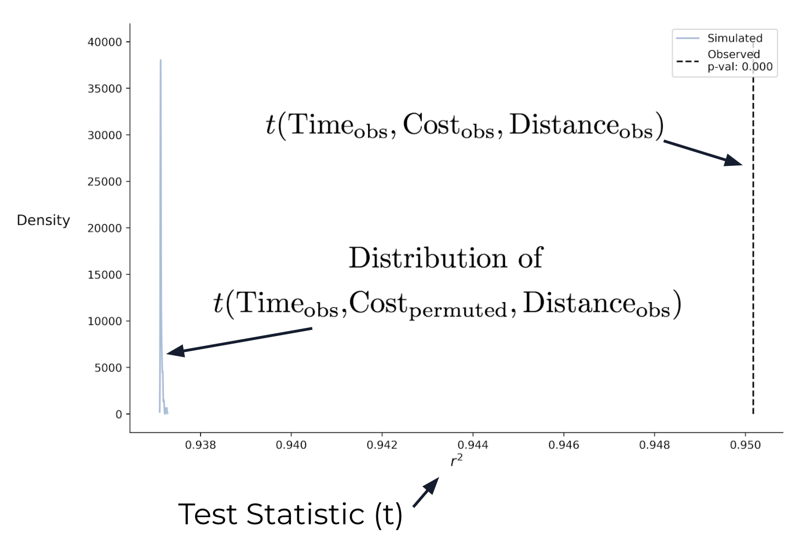</img>

For more information, see
> Brathwaite, Timothy, and Obeid, Hassan, and Bouzaghrane, Mohamed Amine (2021). "Causal Graphs in Choice Modelling: The What, Why, and How." Forthcoming in Handbook of Choice Modelling, 2nd Edition. https://github.com/hassan-obeid/tr_b_causal_2020/blob/master/article/main.pdf.

---

## Causal errors: diagnosis

Collect and analyze additional variables.

Identified relationships between either of the following variable pairs indicate the presence of unobserved confounding.

| negative control outcome (N)  + real exposure (A) | negative control exposure (B)  + real outcome (Y) |
| --- | --- |
| 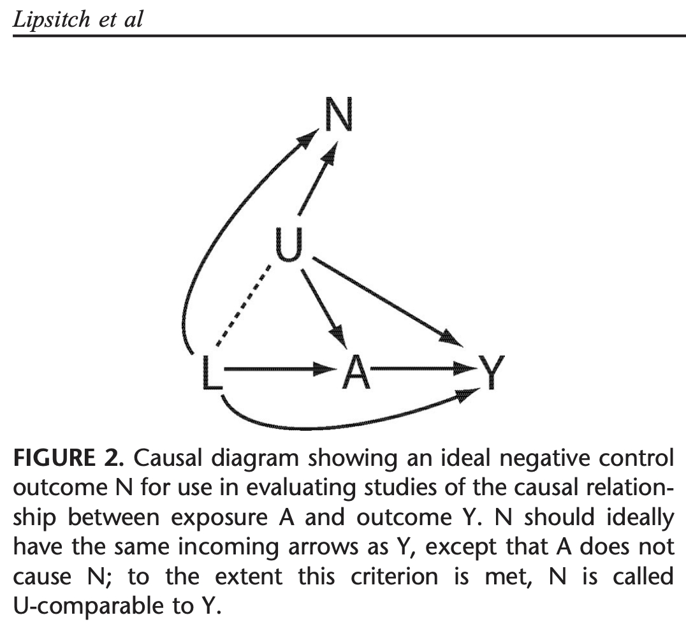</img> | 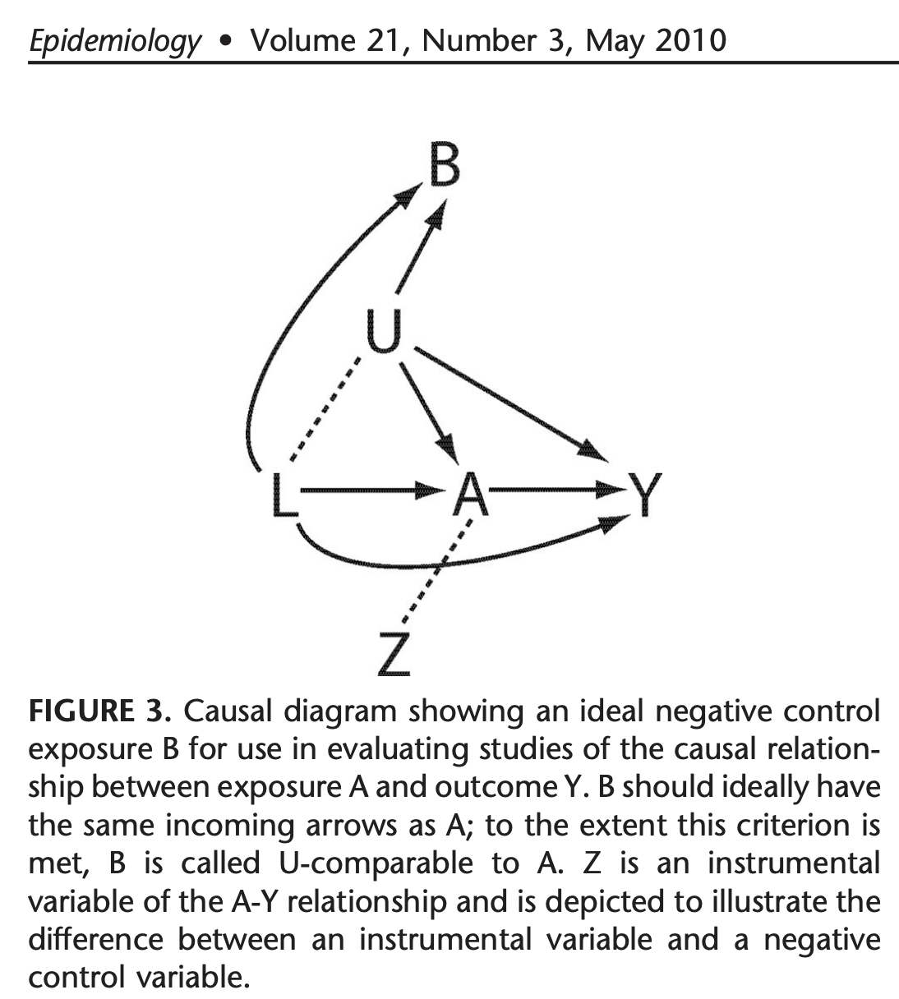</img> |

See [here](http://www.ph.ucla.edu/epi/faculty/greenland/Epi204/Negative_Controls.Epidemiol2010.pdf) and [here](https://arxiv.org/pdf/2009.05641.pdf) for more information.

---

## Causal errors: resolution (I)

Get more data: either on the confounder (U) or on mechanisms (M).

Either is sufficient to construct an accurate likelihood.

</img>

---

## Causal errors: resolution (II)

Model the unobserved confounders

The idea is to replace a real tiger with an "inferred" tiger that shares similar characteristics.

| From | To |
| --- | --- |
| </img> | </img> |
|Real confounders | modeled confounders  |

---

## Causal errors: resolution (III)

Bound the effects on one's inferences

</img>

---

## Recap

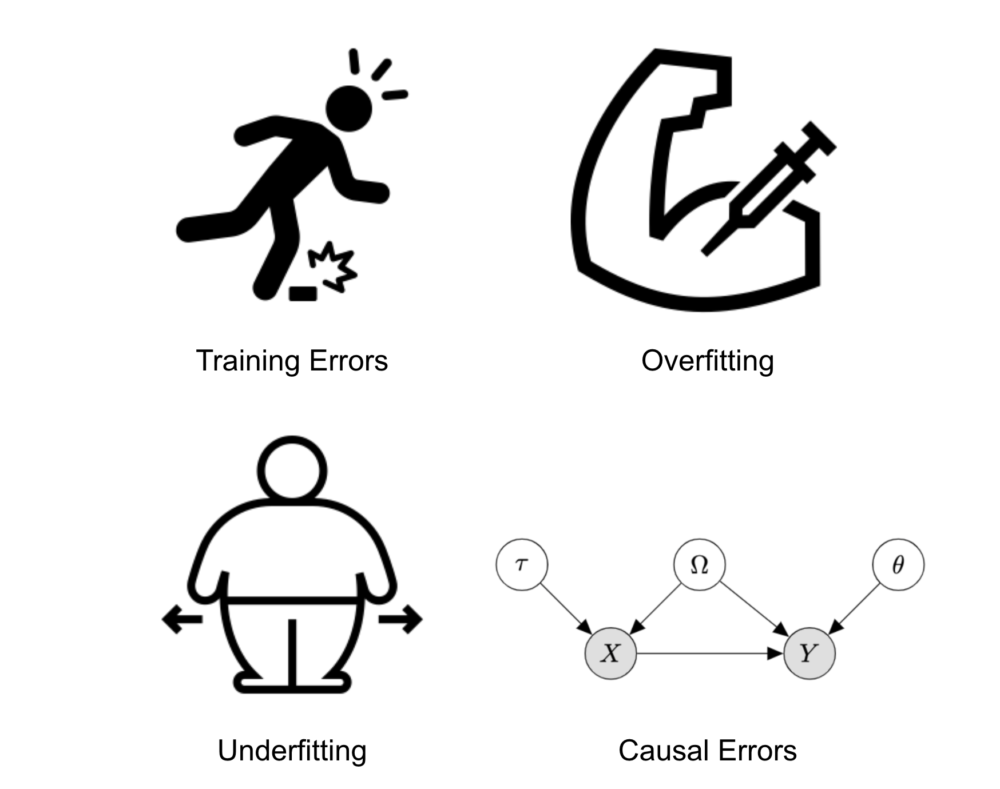</img>

Any one of these issues can tank one's efforts to integrate ML and Discrete Choice.  
For a chance at successful integration "simply" avoid all of them. 🙂

---

## Fin

Thanks for listening!

</img>

Got questions? Open an issue [here]()  <!-- TODO FILL IN LINK -->
